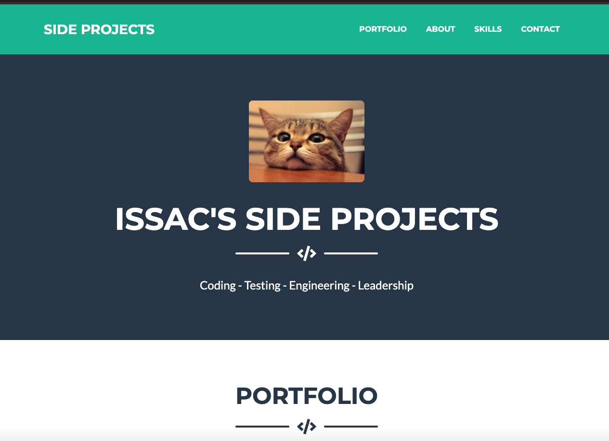

# 08: Professional Materials

Portfolio page in order to showcase new skills and abilities accquired thorughout this course in order become more employer competitive.

## 1.Requirements

* Updated portfolio featuring project 1 and two exemplary homework assignments.
  - Page has the following apps referenced
  - Project 1 > Contact My Reps
  - HW06 > Weather App 
  - HW05 > Day Planner 
  - HW04 > Code Quiz 
  - HW03 > Password Generator

* Update GitHub profile with pinned repositories featuring project 1 and two exemplary assignments. 
  - Projects are pinned in GitHub

* Updated resume.
* Updated LinkedIn profile
  - Resume and linkedin has been updated with new skills. 

## 2.Portfolio Site

* Portfolio uses Formspree.io (https://formspree.io/) in order to integrate a contact email form. We are currently using the free version. Free version doesnt allow for custom redirect after email is sent, hence it redirects to https://carlosissac.github.io/ which displays a 404. If we had the payed version we would redirect to https://carlosissac.github.io/mod08professionalmaterials/

* Weather App is still being worked on, we will finish that project soon.

## 3.Updated GitHub Profile 

* GitHub profile has been updated and listed in my LinkedIn Profile.

## 4.Updated Resume & Updated LinkedIn Profile 

* Tweaked current resume and profile with new skills.

## 5. App ScreenShot 

